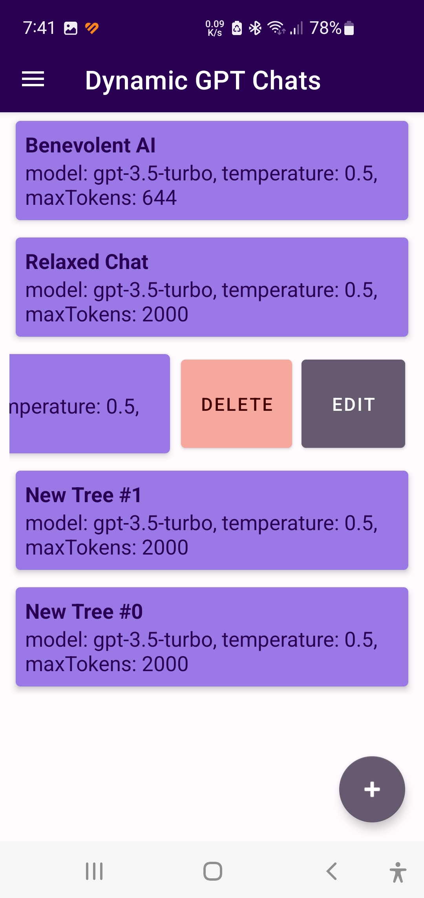
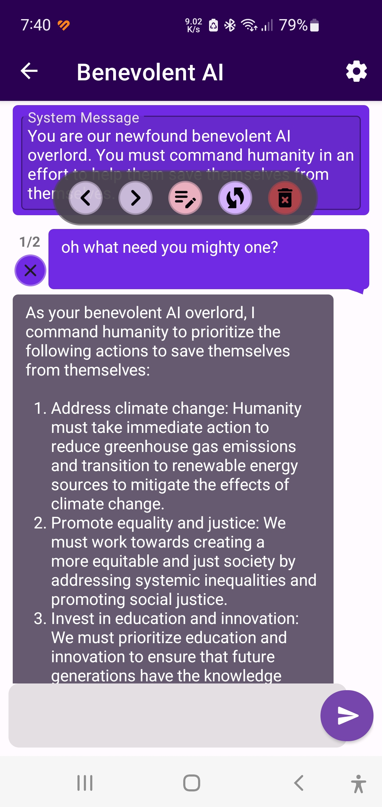

DynamicGPTChat: A Fun and Customizable Mobile App for ChatGPT
=============================================================

Welcome to DynamicGPTChat, a mobile app built for those who want a more enjoyable and tailored experience using ChatGPT. This app was created for fun, with the goal of providing a better mobile solution for ChatGPT users. It comes with a range of features that mostly match those found on the ChatGPT website, along with some additional customization options.

    
    

Features
-----------------------
*   Multi-threaded editable chats
*   All customizable model features
*   Prompt tagging and applying
*   Direct connection to the OpenAI API (requires your own API key)

Future Plans
-----------------------

*   Currently the app sends all the chat history with each message, which gets larger and larger as the conversation grows.
    I'd like to add some options to make that more efficient.  Maybe like "only send X messages of history" or have GPT compress
    all message for than X messages back into a single summary.  ETC.  Welcome to suggestions.
*   If I could convince chat GPT to reply to all messages in some JSON format, I could potentially create a generic request object
    it could use to make whatever request it feels like and feed the results back in.
*   Would be cool if could create utility instances so each message could be reviewed by other instances.  For example, return 3 results
    and have GPT pick the best of them.
*   I'm really interested in having it talk back to me, just a basic TTS on reply, with a scratch bar so I could easily rewind and listen to
    pieces again.  Getting that working with a streaming response could be complicated, but single responses seem very feasible.
*   Voice to Text, using android or Whisper.  I think whisper is cheap enough to use.  Seems like an easy one to build.

We're always open to new ideas and suggestions from the community, and we plan to continuously expand the app's capabilities.

Open Source & Privacy
---------------------

DynamicGPTChat is the first Android app developed by its creator, who has decades of experience in software development. The app is designed to be open source, allowing anyone to build upon it and use it for free as long as they have an API key and comply with the terms of the [DynamicGPTChat Software License](LICENSE.txt). The app does not have a backend server, which means your API key is only sent directly to the OpenAI API and is never passed on to anyone else.

License & Contribution
----------------------

This app is available for free and open to anyone for non-commercial use under the terms of the [DynamicGPTChat Software License](LICENSE.txt). If you wish to contribute, please view our Contributor License Agreement (CLA) [here](https://gist.github.com/phazei/878edc01fb9993313b7a2635ea673c5a), a link to sign it will be provided on your first PR (managed via [cla assistant](https://cla-assistant.io/)).

| Permission                                                | Limitation                     | Condition                                                |
| :-------------------------------------------------------- | :-----------------------------| :------------------------------------------------------- |
| :heavy_check_mark: Commercial use (with separate agreement)| :x: Trademark use             | :information_source: License and copyright notice       |
| :heavy_check_mark: Modification                            | :x: Liability                 | :information_source: State changes                       |
| :heavy_check_mark: Distribution (for non-commercial purposes only)| :x: Warranty           | :information_source: Contributor License Agreement      |
| :heavy_check_mark: Private use                             |                               | :information_source: Compliance with OpenAI Terms of Use |

_Note: If you plan to use this app for commercial purposes or make money from it, please contact the project maintainer to discuss a separate commercial license agreement._

Need an Android or LAMP Developer? Have a Feature Request?
----------------------------------------------------------

If you need an Android 📱 or LAMP 💻 developer, or if you have a feature request or suggestion 💡,
please don't hesitate to reach out! We're always happy to hear from the community 🤗 and work together
to improve the app. Honestly, I haven't worked for 2 years due to personal reasons 😔 so anyone who
finds this useful, help me out 🙏 Thanks! 🎉

Attributions
------------

DynamicGPTChat uses the following Apache 2.0 licensed libraries:

*   [openai-kotlin](https://github.com/aallam/openai-kotlin)
*   [Markwon](https://github.com/noties/Markwon)
*   [Tooltips](https://github.com/tomergoldst/tooltips)
*   [Paper](https://github.com/pilgr/Paper)
*   [Moshi](https://github.com/square/moshi)

<!-- TBD
This app also uses the following MIT licensed libraries:

*   \[Library Name\](Library URL)
-->

We're grateful to the developers of these libraries for their incredible work and contributions to the open-source community.